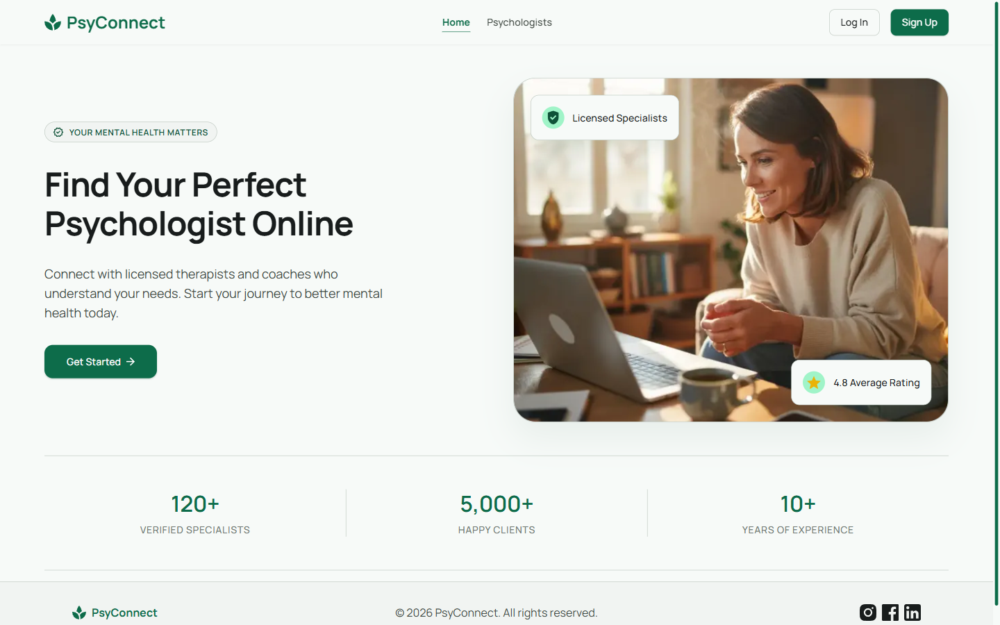
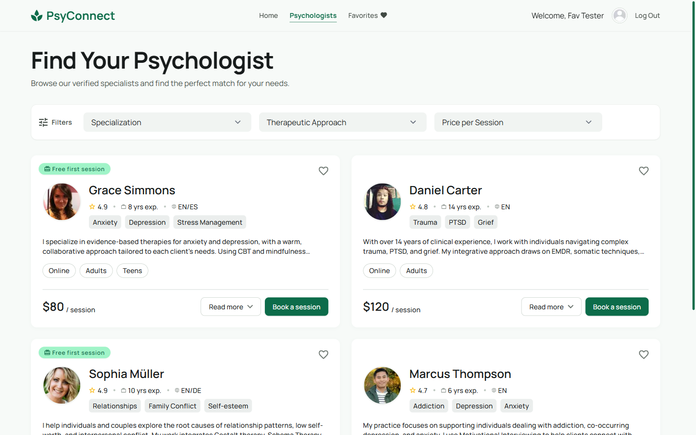
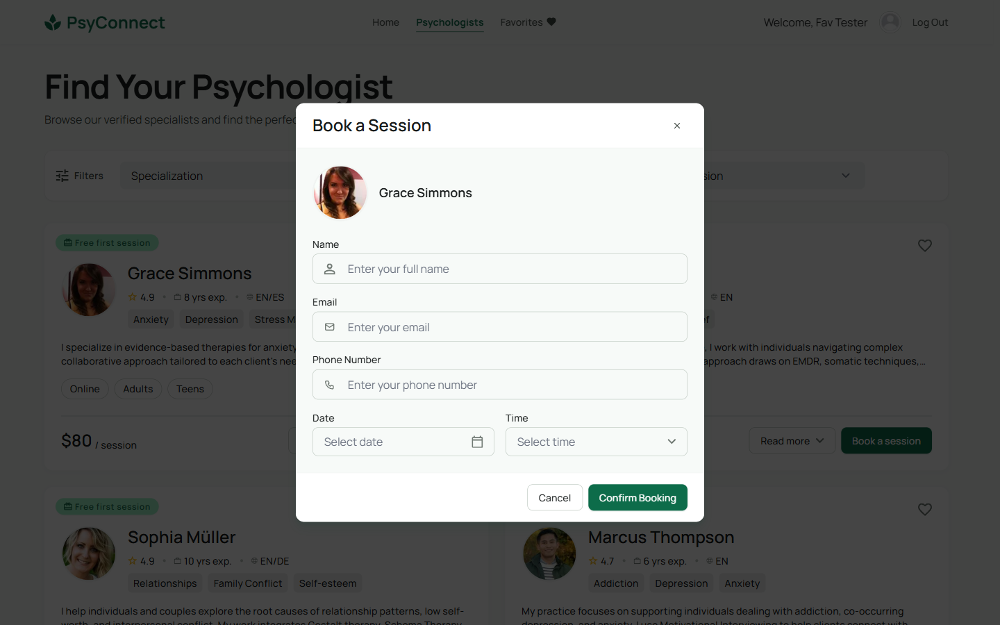
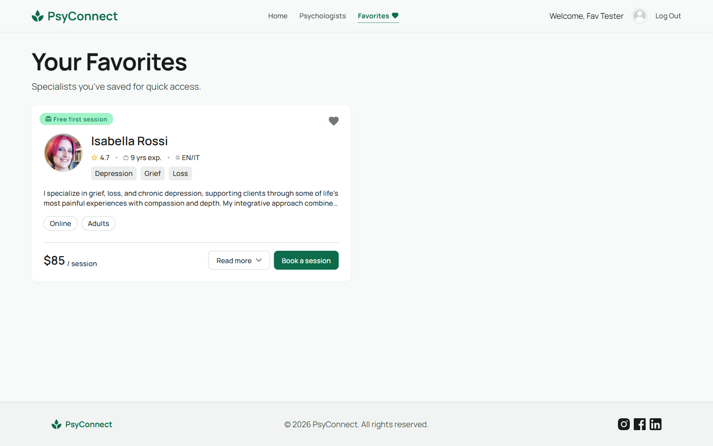

# PsyConnect

Web application for finding and booking online sessions with licensed psychologists and therapists.

Live version: https://psy-connect-five.vercel.app

## About

PsyConnect solves a simple problem: finding a suitable specialist usually means digging through scattered
listings with no way to compare them. The application gathers verified psychologists in one catalog, lets a
user filter them by specialization, therapeutic approach and price, read profiles with client reviews, save
specialists to a personal favorites list and book a session directly from the card.

Main features:

- landing page with a short introduction to the service;
- catalog of specialists with filtering and "load more" pagination;
- expandable specialist cards with therapeutic approaches, full bio and client reviews;
- registration, log in and log out with an httpOnly cookie session;
- personal favorites list available to authenticated users only;
- session booking form with date and time selection.

The interface is desktop-only: the reference layout is 1440px wide and the minimum supported width is 1024px.

## Screenshots

Home page:



Catalog with filters:



Session booking:



Favorites:



## Tech stack

| Area                 | Technology                                                   |
| -------------------- | ------------------------------------------------------------ |
| Framework            | Next.js 16 (App Router), React 19                            |
| Language             | TypeScript                                                   |
| Styling              | CSS Modules, modern-normalize                                |
| Data fetching        | TanStack Query v5 (`useInfiniteQuery` for pagination)        |
| State management     | Zustand v5                                                   |
| Forms and validation | Formik, Yup                                                  |
| HTTP client          | Axios                                                        |
| Icons                | Tabler Icons (`@tabler/icons-react`)                         |
| Notifications        | react-hot-toast                                              |
| Images               | `next/image`                                                 |
| Compiler             | React Compiler (`reactCompiler` enabled in `next.config.ts`) |
| Tooling              | ESLint, Prettier                                             |

Server Components are the default; Client Components are used only where interactivity is required —
forms, modals, filters and any code depending on TanStack Query or Zustand.

## Getting started

Requirements: Node.js 20 or newer and npm.

```bash
git clone https://github.com/OksanaVakuliak/psy-connect.git
cd psy-connect
npm install
```

Create a `.env.local` file in the project root, using `.env.example` as a reference:

```bash
API_URL=https://psy-connect.b.goit.study
```

Run the development server:

```bash
npm run dev
```

The application is available at http://localhost:3000.

## Scripts

| Command                | Description                       |
| ---------------------- | --------------------------------- |
| `npm run dev`          | Start the development server      |
| `npm run build`        | Create a production build         |
| `npm run start`        | Serve the production build        |
| `npm run lint`         | Run ESLint                        |
| `npm run lint:fix`     | Run ESLint and apply fixes        |
| `npm run format`       | Format the codebase with Prettier |
| `npm run format:check` | Check formatting without writing  |

## Deployment

The project is deployed on Vercel at https://psy-connect-five.vercel.app. Push to `main` triggers a
production deployment; every pull request gets its own preview deployment. `API_URL` must be set in the
project environment variables.

## API

Backend: https://psy-connect.b.goit.study

API documentation (Swagger): https://psy-connect.b.goit.study/api-docs

Authentication is based on an httpOnly `accessToken` cookie issued by the backend on register and login.

## Design

Figma layout: https://www.figma.com/design/EUUmO7d94DYsxjMgDUKIe5/PsyConnect--Copy-

## Workflow

`main` — production branch, `develop` — integration branch. Both are protected: changes land only through
pull requests. Feature branches are created from `develop`.

## License

This project is created for educational purposes.
